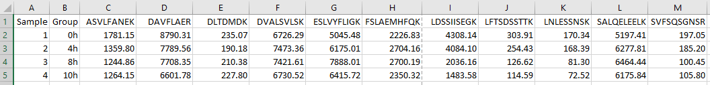
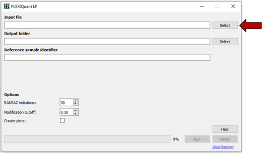
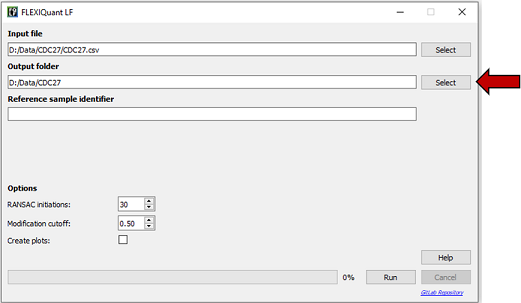
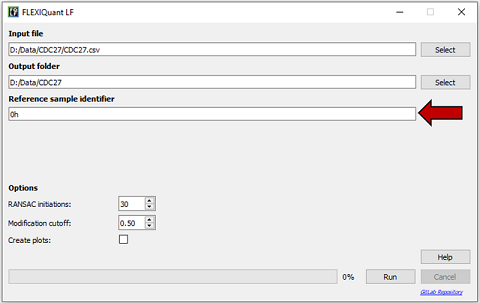
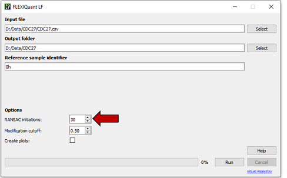
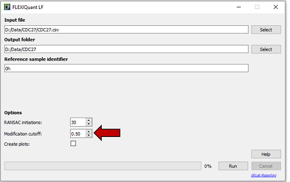
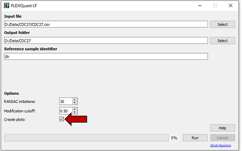
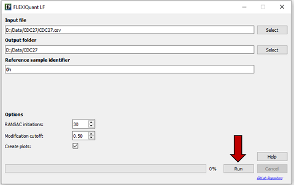

# FLEXIQuant-LF
## Overview
Improvements in LC-MS/MS methods and technology have enabled the identification of thousands of modified peptides in a 
single proteomics experiment. However, to fully understand the role of such post-translational modifications (PTMs), 
robust quantification methods are crucial to identify and monitor the modification extent. Here, we introduce 
FLEXIQuant-LF, a software tool for large-scale identification of differentially modified peptides and quantification of 
their modification extent without prior knowledge of the type of modification. We developed FLEXIQuant-LF using 
label-free quantification of unmodified peptides and random sample consensus (RANSAC)-based robust linear regression to
quantify the modification extent of peptides. The unbiased approach of FLEXIQuant-LF to assess the modification extent 
in quantitative proteomics data provides a novel platform to better understand the function and regulation of PTMs in 
new experiments and reanalyzed data. 
 
## Download and Installation
### Requirements
Windows 10 and 800MB of free disk space

### Download
The FLEXIQuant LF GUI executable can be downloaded [here]() and the Python source code 
[here](https://gitlab.com/KonstantinKahnert/poormansflex/-/tree/master/src/GUI). 
The FLEXIQuant LF CLI executable can be downloaded [here]() and the Python source code 
[here](https://gitlab.com/KonstantinKahnert/poormansflex/-/tree/master/src/CLI).

### Installation
No installation needed. Just move the folder to your location of choice.

## Getting Started
### Input format
FLEXIQuant LF requires a comma separated file (.csv) containing peptide intensities in the following format as input:

<table border="0" width="100%">
    <thead>
        <tr>
            <th scope="col">Column</th>
            <th scope="col">Column header</th>
            <th scope="col">Description</th>
        </tr>
    </thead>
    <tbody>
        <tr>
            <td align="center">1</td>
            <td align="center">Sample</td>
            <td>Name of sample (unique sample name)</td>
        </tr>
        <tr>
            <td align="center">2</td>
            <td align="center">Group</td>
            <td>Name experimental group (will be used to identify reference samples)</td>
        </tr>
        <tr>
            <td align="center">3 - n</td>
            <td align="center">*</td>
            <td>Peptide intensities</td>
        </tr>
    </tbody>
</table>

\* can be anything, e.g. peptide sequence  
  
  
Example file:  
 

The example input file can be downloaded [here](https://gitlab.com/KonstantinKahnert/poormansflex/-/tree/master/test_file).
  
  
### Output
FLEXIQuant LF creates the following outputs:
*	_FQ-LF-output_raw_scores.csv:
This file contains the calculated raw scores for all peptides.

*	_FQ-LF-output_RM_scores.csv:
This file contains the calculated RM scores for all peptides that were removed by raw score filtering.
Additionally, the following columns are included:
Slope:  Slope of the regression line of the best linear regression model
R2 model: Coefficient of determination of the best linear regression model 
(calculated only using inliers as determined by RANSAC)
R2 data: Coefficient of determination of the best linear regression model 
(calculated using all data points)

*	_FQ-LF-output_diff_modified.csv:
This file states for each peptide if it was classified as differentially modified based on the chosen modification cutoff (True) or not (False)

*	_FQ-LF-output_removed_peptides.csv:
This file lists the peptides that were remove by raw score filtering i.e. that resulted in a raw score higher than the median raw score of the sample plus three times the median absolute deviation of all raw scores of the sample

*	_FQ-LF-output_regression_plots.pdf (optionally):
Contains a linear regression plot for each sample. Can be used as quality control the check if the linear regression line was fitted correctly.

## Usage GUI

#### Parameters
*	Input file: Path to input file

*	Output folder: Path to output folder

*	Reference sample identifier: Based on this FLEXIQuant LF determines which samples to choose as reference samples. This needs to match exactly the value in the Group column for all samples that shall be taken as reference.

*	RANSAC initiations: Number of times FLEXIQuant LF fits a new RANSAC linear regression model to each sample to choose the best model. Between 5 and 100 initiations can be selected. The more initiations, the higher the reproducibility and the probability that FLEXIQuant LF finds the optimal model. However, choosing a high number can significantly increases the run time and more than 50 initiations rarely provide additional benefit. Default: 30

*	Modification cutoff: RM score cutoff used to classify peptides as differentially modified. Default: 0.5

*	Create plots: If checked, a linear regression plot for each sample is created. All plots will be saved in one pdf file (_FQ-LF-output_regression_plots.pdf)

#### Step by step
1.	**Select input file**  
    

2.	**Select output fold**  
Folder of the selected input file will be selected automatically as output folder. If a different location is preferred, select a different location.  
   

3.	**Enter reference sample identifier**  
Needs to match group column value of reference samples  
   

4.	**Select number of RANSAC initiations**  
The default setting is 30  
   

5.	**Select modification cutoff**  
The default setting is 0.5  
    

6.	**Check “Create plots” checkbox if you want FLEXIQuant LF to create linear regression plots**  
    

7.	**Click “Run”**  
   

## Usage CLI
Full usage:  
`FLEXIQuant_LF_CLI.exe -i PATH -o PATH -r TEXT [-n INTEGER] [-mc FLOAT] [-p]`
  
Usage example:  
`FLEXIQuant_LF_CLI.exe -i path/to/input_file.csv -o path/to/output_folder/ -r "Control" -n 30 -mc 0.5 -p`  
  
  
**Required arguments:**  
`-i, --input_file PATH`  
    Path of the comma separated input file (.csv)  
`-o, --output_folder PATH`  
    Path to the folder in which the output files should be placed  
`-r, --reference TEXT`  
    Reference sample identifier. This must match the "Group" column value of the reference samples  
  
  
**Optional arguments:**  
`-n, --num_init INTEGER`  
    Number of times FLEXIQuant LF fits a new RANSAC linear regression model to each sample to choose the best model.  
    This should be an integer between 5 and 100. The more initiations, the higher the reproducibility and the probability   
    that FLEXIQuant LF finds the optimal model. However, choosing a high number can significantly increases the run  
    time and more than 50 initiations rarely provide additional benefit. The default value is 30  
`-mc, --mod_cutoff FLOAT`  
    RM score cutoff used to classify peptides as differentially modified. Should be a a float between 0 and 1.  
    The default value is 0.5  
`-p, --create_plots`  
    If selected a linear regression plot for each sample is created. All plots will be saved in one pdf file   
`-h, --help`  
    Show help message and exit  

## Contact
